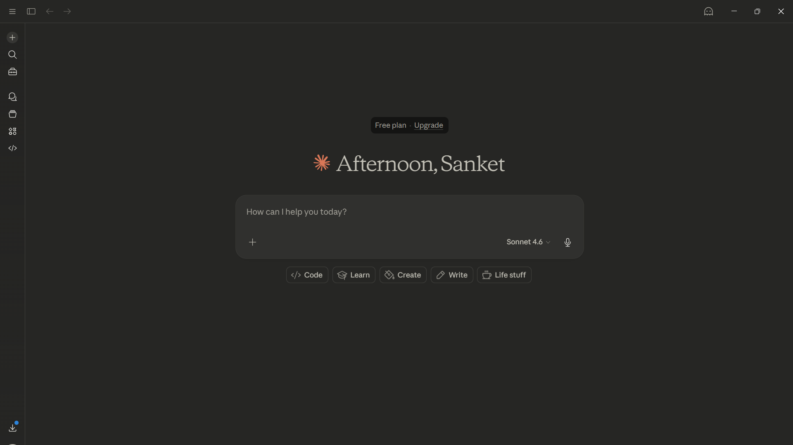
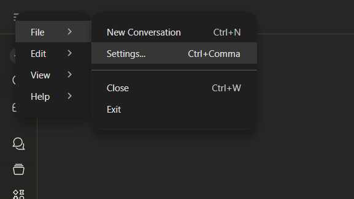
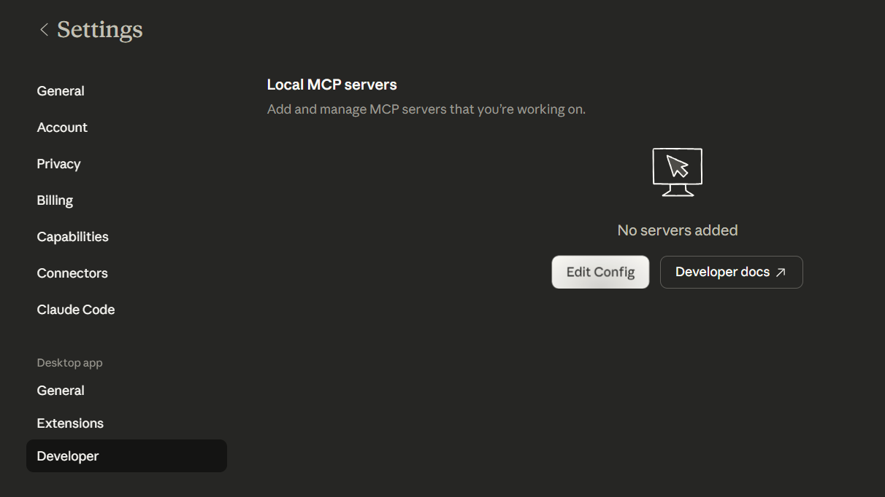
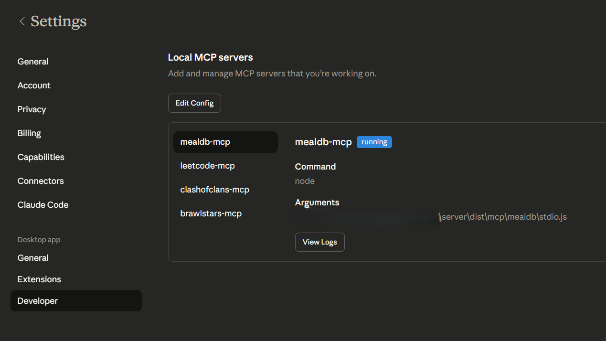
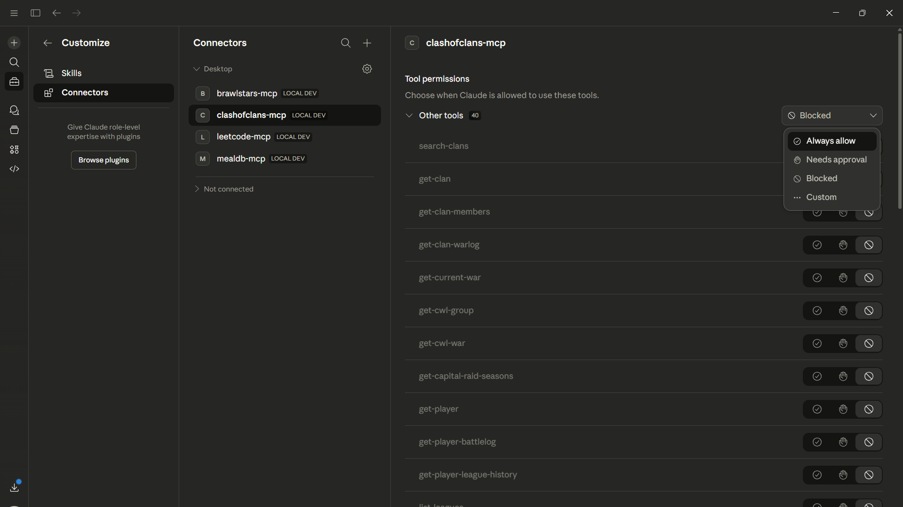
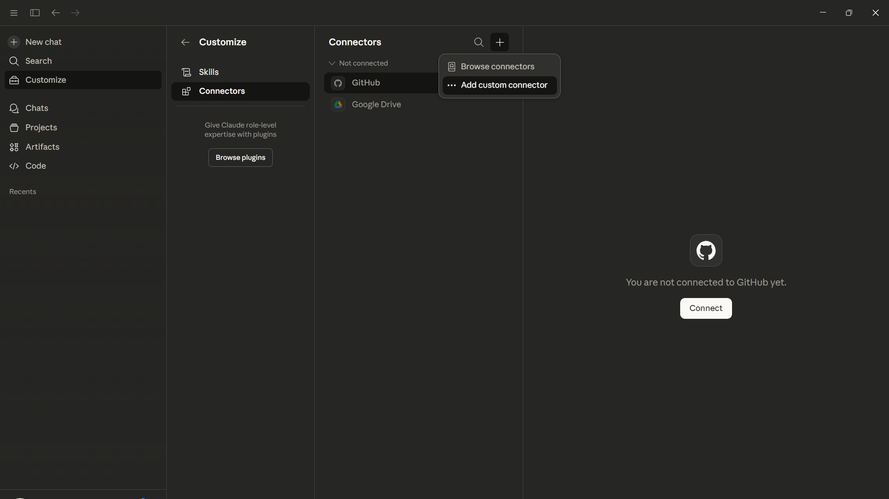
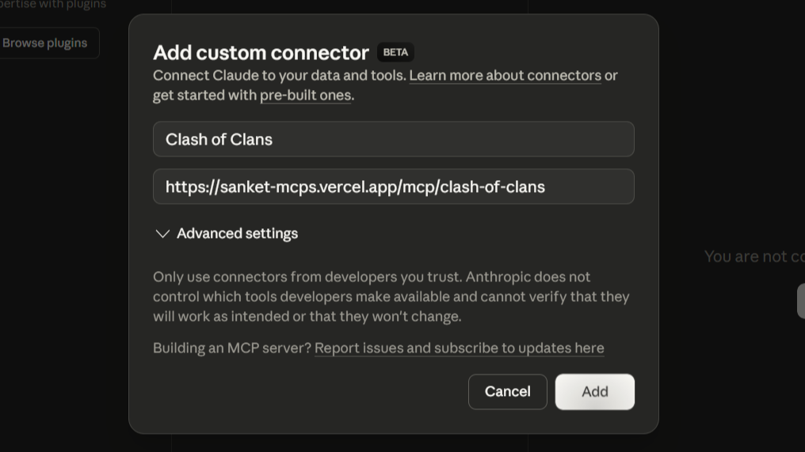
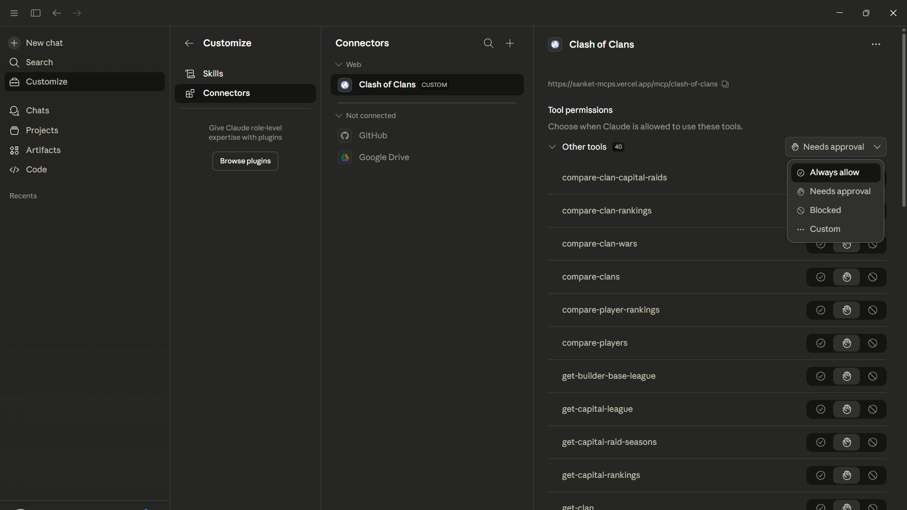

# MCP Servers

- `clash-of-clans`: https://sanket-mcps.vercel.app/mcp/clash-of-clans
- `brawlstars`: https://sanket-mcps.vercel.app/mcp/brawlstars
- `leetcode`: https://sanket-mcps.vercel.app/mcp/leetcode
- `mealdb`: https://sanket-mcps.vercel.app/mcp/mealdb

## Use cases

- `brawlstars`: player and club lookups, rankings by country/global, and matchup-style comparisons.
- `clash-of-clans`: clan scouting and war readiness summaries, war log lookups, and player/clan comparison helpers.
- `leetcode`: user profile analysis, problem discovery (by tag/difficulty), contest information, and discussion topic exploration.
- `mealdb`: recipe search, category/ingredient/cuisine filtering, and recipe-guided meal inspiration or planning.

## Server-specific docs

- [Brawl Stars MCP](server/src/mcp/brawlstars/README.md)
- [Clash of Clans MCP](server/src/mcp/clash-of-clans/README.md)
- [LeetCode MCP](server/src/mcp/leetcode/README.md)
- [TheMealDB MCP](server/src/mcp/mealdb/README.md)

## Setup

### Setup Locally

1. Open Claude Desktop.



2. Go to **Settings**.



3. Go to **Developer Mode** and click **Edit Config**.



4. Edit the config by adding static paths to mcp servers file and save it.

```bash
{
  ...
  ,
  "mcpServers": {
    "mealdb-mcp": {
      "command": "node",
      "args": [
        "[Parent-Folder]\\Model-Context-Protocol\\server\\dist\\mcp\\mealdb\\stdio.js"
      ]
    },
    "leetcode-mcp": {
      "command": "node",
      "args": [
        "[Parent-Folder]\\Model-Context-Protocol\\server\\dist\\mcp\\leetcode\\stdio.js"
      ]
    },
    "clashofclans-mcp": {
      "command": "node",
      "args": [
        "[Parent-Folder]\\Model-Context-Protocol\\server\\dist\\mcp\\clash-of-clans\\stdio.js"
      ]
    },
    "brawlstars-mcp": {
      "command": "node",
      "args": [
        "[Parent-Folder]\\Model-Context-Protocol\\server\\dist\\mcp\\brawlstars\\stdio.js"
      ]
    }
  }
}

```

5. Reopen Claude Desktop and go to **Developer Mode**.



6. Select **Always Allow** so the AI does not ask for permissions repeatedly.



### Setup Remote Server

1. Open Claude.


2. Go to **Custom Connector**.



3. Add your MCP server URL and your preferred name.



4. Select **Always Allow** so the AI does not ask for permissions repeatedly.



## Demo prompts (copy-paste)

### Clash of Clans

```text
Provide a complete summary of a clan tag [clanTag] in clash of clans. Include clan profile, members, war activity, and key insights.
```

### Brawl Stars

```text
Provide a full report for brawlstars player tag [playerTag]. Include trophies, top brawlers, recent performance, and improvement suggestions.
```

### LeetCode

```text
Compare these two leetcode profiles: [username1] and [username2]. Show solved counts by difficulty, contest performance, language usage, strengths, and a final comparison summary.
```

### TheMealDB

```text
Suggest a few categories or cuisines I can cook from. Then recommend one dish with its complete recipe, ingredients list, and step-by-step instructions.
```
